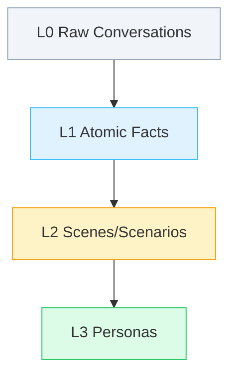
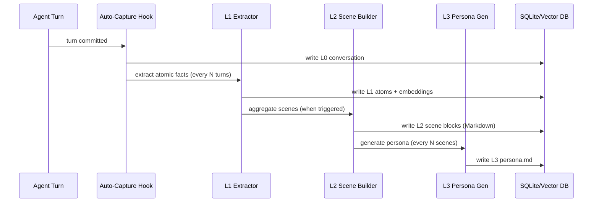
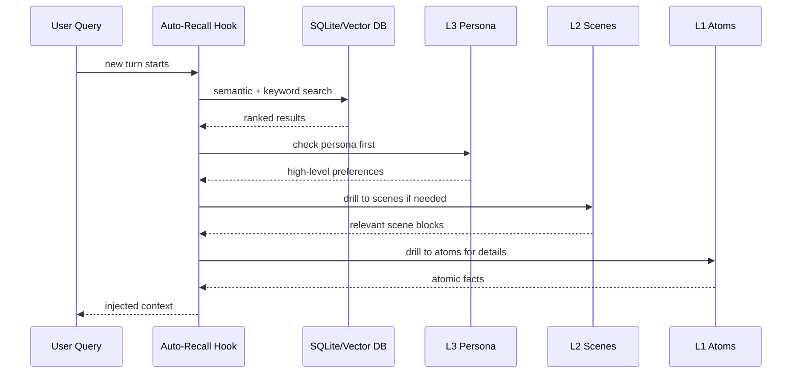
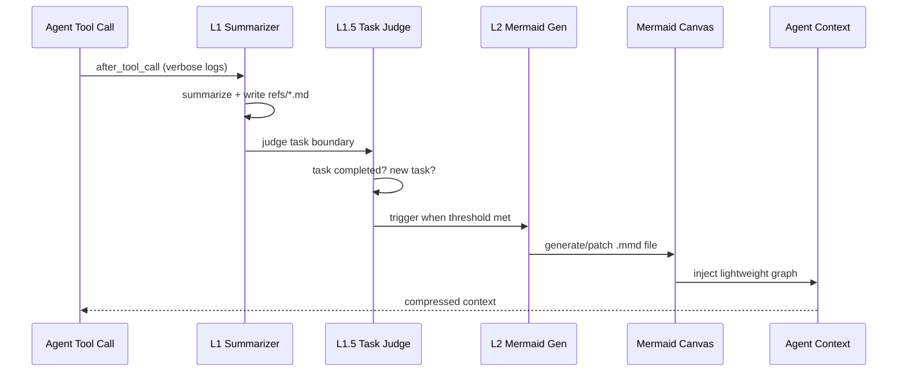
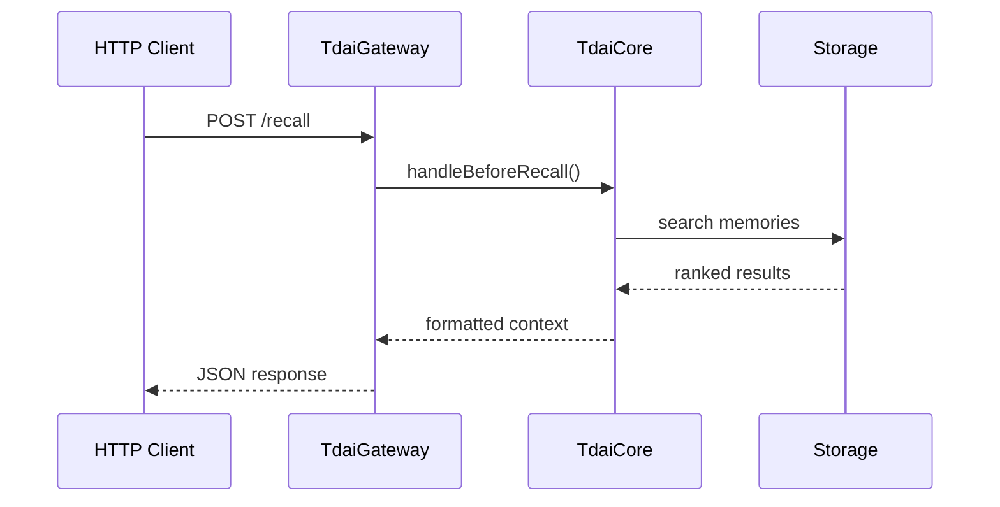

# TencentDB-Agent-Memory - AI Context Index

> **Last Updated**: 2026-09-15 | **Version**: 0.3.6 | **Status**: Production-Ready

---

## Change Log

| Date | Change | Author |
|------|--------|--------|
| 2026-09-15 | Multi-user memory stores: per-user TdaiCore/dataDir routing in gateway, provider identity chain, e2e suite + CI jobs (plan: docs/plans/2026-09-14-multi-user-memory-stores.md) | Berton |
| 2026-05-24 15:23:25 | Incremental update: Added scripts module documentation, updated coverage to 100% | AI Architect |
| 2026-05-24 15:08:14 | Incremental update: Added utils & gateway modules, updated coverage | AI Architect |
| 2026-05-24 14:18:33 | Initial AI context index creation | AI Architect |

---

## Project Vision

TencentDB-Agent-Memory is a **four-layer local memory system** for AI agents that implements **symbolic short-term memory** and **layered long-term memory**. The project rejects flat vector storage in favor of a hierarchical semantic pyramid (L0→L1→L2→L3) that enables agents to remember what should be remembered while reducing token usage by up to 61% and improving task success rates by 51%.

**Core Innovation**: Memory is not about hoarding everything — it's about sparing humans from repetition. The system combines context offloading (symbolic Mermaid graphs) with memory layering (progressive disclosure) to achieve both compression AND traceability.

---

## Architecture Overview

### Memory Layering Paradigm



### Dual-Storage Strategy

- **Bottom Layers** (L0/L1): SQLite/vector database for full-text retrieval
- **Top Layers** (L2/L3): Markdown files for human inspection + white-box debugging

### Symbolic Memory System

```mermaid
graph LR
    Log[Verbose Logs] -->|"Offload"| FS[External FS refs/*.md]
    Log -->|"Extract Relations"| MMD[Mermaid Canvas]
    MMD -->|"Light Injection"| Agent[Agent Context]
    Agent -.|"node_id Recall"|.-> FS

    style Log fill:#f1f5f9,stroke:#94a3b8,stroke-dasharray: 5 5
    style FS fill:#f8fafc,stroke:#cbd5e1,stroke-width:2px
    style MMD fill:#eff6ff,stroke:#3b82f6,stroke-width:2px
    style Agent fill:#fffbeb,stroke:#f59e0b,stroke-width:2px
```

---

## Module Structure

```mermaid
graph TD
    A["TencentDB-Agent-Memory"] --> B["src/core"];
    A --> C["src/offload"];
    A --> D["src/adapters"];
    A --> E["src/utils"];
    A --> F["src/gateway"];
    A --> G["hermes-plugin"];
    A --> H["scripts"];
    A --> I["src/cli"];

    B --> B1["TdaiCore - Host-neutral facade"];
    B --> B2["Memory Pipeline - L0→L3 extraction"];
    B --> B3["Storage Layer - SQLite/Vector"];
    B --> B4["Hooks - Auto-capture/recall"];

    C --> C1["Context Offload - L1/L1.5/L2/L4"];
    C --> C2["State Management"];
    C --> C3["Mermaid Generation"];

    D --> D1["OpenClaw Adapter"];
    D --> D2["Standalone/Hermes Adapter"];

    E --> E1["Checkpoint Manager"];
    E --> E2["Pipeline Manager"];
    E --> E3["Backup & Utilities"];

    F --> F1["HTTP Sidecar Server"];
    F --> F2["REST API Endpoints"];

    G --> G1["Python Gateway Plugin"];

    H --> H1["Migration & Export Tools"];
    H --> H2["Diagnostic Scripts"];
    H --> H3["Gateway Lifecycle Mgmt"];

    I --> I1["Memory Seeding"];
    I --> I2["Debugging Commands"];

    click B1 "./src/core/CLAUDE.md" "Core Engine"
    click C1 "./src/offload/CLAUDE.md" "Offload Module"
    click D1 "./src/adapters/CLAUDE.md" "Adapters"
    click E1 "./src/utils/CLAUDE.md" "Utils Module"
    click F1 "./src/gateway/CLAUDE.md" "Gateway Module"
    click H1 "./scripts/CLAUDE.md" "Scripts & Utilities"
```



### Module Index

| Module | Path | Language | Responsibility | Status | Documentation |
|--------|------|----------|----------------|---------|---------------|
| **Core Engine** | `src/core/` | TypeScript | Memory extraction, storage, recall, pipeline management | ✅ Production | ✅ Complete |
| **Context Offload** | `src/offload/` | TypeScript | Short-term compression, Mermaid canvas, L1-L4 processing | ✅ Production | ✅ Complete |
| **Adapters** | `src/adapters/` | TypeScript | OpenClaw/Hermes integration, host abstraction | ✅ Production | ✅ Complete |
| **Utils** | `src/utils/` | TypeScript | Checkpoint, pipeline, backup, shared utilities | ✅ Stable | ✅ Complete |
| **Gateway** | `src/gateway/` | TypeScript | HTTP sidecar server, REST API | ✅ Production | ✅ Complete |
| **Hermes Plugin** | `hermes-plugin/` | Python | Hermes Gateway integration, HTTP endpoints | ✅ Production | ✅ Complete |
| **CLI Tools** | `src/cli/` | TypeScript | Memory seeding, debugging commands | ✅ Stable | ✅ Complete |
| **Scripts** | `scripts/` | Shell/TS | Migration, export, diagnostics, lifecycle management | ✅ Stable | ✅ **New** |

---

## Technology Stack

### Primary Languages
- **TypeScript** (87%): Core memory engine, offload system, adapters, gateway, scripts
- **Python** (5%): Hermes Gateway plugin
- **Shell** (8%): DevOps, lifecycle management, diagnostics

### Key Dependencies
- **Storage**: `sqlite-vec` (local vector DB), `sqlite3`
- **LLM Integration**: `ai` SDK, `@ai-sdk/openai`
- **Text Processing**: `@node-rs/jieba` (Chinese tokenization)
- **Build**: `tsdown`, `typescript`
- **Testing**: `vitest`
- **HTTP**: Native `http` module (zero external framework dependencies for gateway)

### Host Frameworks
- **OpenClaw** (>=2026.3.13): Primary integration target
- **Hermes Gateway** (>=0.3.4): Alternative backend
- **Standalone Mode**: Direct HTTP API via Gateway server

---

## Running & Development

### Quick Start (OpenClaw)

```bash
# Install plugin
openclaw plugins install @tencentdb-agent-memory/memory-tencentdb
openclaw gateway restart

# Enable (zero-config)
cat > ~/.openclaw/openclaw.json << 'EOF'
{
  "memory-tencentdb": {
    "enabled": true
  }
}
EOF

# Enable short-term compression (optional)
openclaw config set memory-tencentdb.config.offload.enabled true
bash scripts/openclaw-after-tool-call-messages.patch.sh
```

### Quick Start (Hermes/Gateway)

```bash
# Start Gateway standalone
export TDAI_LLM_API_KEY="sk-..."
node --import tsx src/gateway/server.ts

# Or use Docker
cd docker/opensource
docker build -f Dockerfile.hermes -t hermes-memory .
docker run -d \
  --name hermes-memory \
  -p 8420:8420 \
  -e MODEL_API_KEY="your-key" \
  -e MODEL_BASE_URL="https://api.lkeap.cloud.tencent.com/v1" \
  -v hermes_data:/opt/data \
  hermes-memory
```

### Development Workflow

```bash
# Build
npm run build

# Run tests
npm test
npm run test:watch
npm run test:coverage

# Linting (if configured)
npm run lint

# Local memory debugging
npm run read-local-memory

# Start Gateway (for standalone/Hermes mode)
npm run start:gateway
```

---

## Configuration

### Level 1: Daily Tuning (90% use cases)

```jsonc
{
  "storeBackend": "sqlite",           // Storage backend
  "recall.strategy": "hybrid",        // keyword/embedding/hybrid
  "recall.maxResults": 5,
  "pipeline.everyNConversations": 5,  // L1 extraction trigger
  "persona.triggerEveryN": 50,        // L3 generation trigger
  "offload.enabled": false            // Short-term compression
}
```

### Level 2: Advanced Tuning

```jsonc
{
  "pipeline.enableWarmup": true,
  "pipeline.l1IdleTimeoutSeconds": 600,
  "offload.mildOffloadRatio": 0.5,
  "offload.aggressiveCompressRatio": 0.85,
  "bm25.language": "zh"               // Tokenizer: zh/en
}
```

### Gateway Configuration

```yaml
# tdai-gateway.yaml
server:
  port: 8420
  host: "127.0.0.1"

data:
  baseDir: "~/.memory-tencentdb/memory-tdai"

llm:
  baseUrl: "https://api.openai.com/v1"
  apiKey: "${OPENAI_API_KEY}"
  model: "gpt-4o"

memory:
  storeBackend: "sqlite"
  # ... (same as OpenClaw config)

multiUser:
  enabled: false            # opt-in; per-user TdaiCore + dataDir isolation
  ownerUserIds: []          # normalized at load; owners route to the main store
```

### Full Schema: See `openclaw.plugin.json`

---

## Testing Strategy

### Test Structure
- **Unit Tests**: `src/**/*.test.ts` - Core logic, pipeline stages
- **E2E Tests**: `src/**/*.e2e.test.ts` - real-gateway HTTP suite (`pnpm test:e2e`)
- **Integration Tests**: `hermes-plugin/memory/memory_tencentdb/tests/`
- **Soak Tests**: `__tests__/soak/` - Long-running sessions

### Coverage Areas
1. **Memory Pipeline**: L0→L1→L2→L3 extraction accuracy
2. **Storage**: Vector search, BM25, embedding deduplication
3. **Offload**: L1/L1.5/L2/L4 processing, Mermaid generation
4. **Gateway**: HTTP endpoint routing, request validation
5. **Concurrency**: Session isolation, checkpoint recovery
6. **Migration**: SQLite ↔ TCVDB data portability

### Running Tests

```bash
# All tests
npm test

# E2E (real gateway subprocess + HTTP)
npm run test:e2e

# Watch mode
npm run test:watch

# Coverage report
npm run test:coverage

# Hermes plugin tests
cd hermes-plugin/memory/memory_tencentdb
pytest
```

---

## Encoding Standards

### File Organization
```
src/
├── core/          # Memory extraction, storage, recall
├── offload/       # Short-term compression
├── adapters/      # Host framework integration
├── utils/         # Shared utilities, checkpoint, pipeline
├── gateway/       # HTTP sidecar server
├── cli/           # Command-line tools
└── config.ts      # Configuration parsing

scripts/
├── migrate-sqlite-to-tcvdb/   # Data migration
├── export-tencent-vdb/         # Data export
├── read-local-memory/          # Debug utilities
├── memory-tencentdb-ctl.sh     # Lifecycle management
├── setup-offload.sh            # Offload configuration
└── export-diagnostic.sh        # Diagnostics

hermes-plugin/
└── memory/memory_tencentdb/    # Python Gateway adapter
```

### Naming Conventions
- **Files**: `kebab-case.ts` (e.g., `l0-recorder.ts`)
- **Classes**: `PascalCase` (e.g., `TdaiCore`, `OffloadStateManager`)
- **Functions**: `camelCase` (e.g., `performAutoRecall`)
- **Constants**: `SCREAMING_SNAKE_CASE` (e.g., `PLUGIN_DEFAULTS`)

### Code Style
- **TypeScript**: Strict mode enabled
- **Imports**: Absolute paths from project root
- **Comments**: JSDoc for public APIs
- **Logging**: Structured tags (e.g., `[memory-tdai] [core]`)

---

## AI Usage Guidelines

### For AI Assistants & Agents

1. **Memory Access**: Use `tdai_memory_search` and `tdai_conversation_search` tools
2. **Context Injection**: Memory auto-injects before each turn (no manual action needed)
3. **Debugging**: Inspect `~/.openclaw/memory-tdai/` for raw memory artifacts
4. **Mermaid Canvases**: Read `mmds/*.mmd` files for task state visualization
5. **Gateway API**: Use HTTP endpoints for non-OpenClaw integration

### Common Pitfalls

1. **Ignoring L3 Signals**: Persona layer (`persona.md`) contains high-level preferences — check it first
2. **Missing node_id Links**: Always trace Mermaid nodes back to `refs/*.md` for evidence
3. **Concurrency Bugs**: Never share `scheduler` instances across sessions (use `SessionRegistry`)
4. **Token Estimation**: Use `buildTiktokenContextSnapshot()` for accurate counts, not string length
5. **Gateway Timeouts**: Configure appropriate `recall.timeoutMs` to avoid blocking HTTP requests

### Key Invariants

- **Traceability**: Every compressed message must have a `node_id` → `result_ref` chain
- **Session Isolation**: `handleSessionEnd()` only affects ONE session (not global shutdown)
- **Graceful Degradation**: If embedding fails, fall back to BM25 keyword search
- **Atomic Operations**: L1/L1.5/L2 state updates must be checkpoint-able
- **Split-State Safety**: Checkpoint `runner_states` and `pipeline_states` never overlap

---

## Performance Benchmarks

| Memory Type | Benchmark | Without Plugin | With Plugin | Improvement |
|-------------|-----------|----------------|-------------|-------------|
| **Short-term** | WideSearch | 33% success | 50% success | +51.52% |
| **Short-term** | SWE-bench | 58.4% | 64.2% | +9.93% |
| **Short-term** | Token Usage | 221.31M | 85.64M | -61.38% |
| **Long-term** | PersonaMem | 48% accuracy | 76% accuracy | +59% |

*Results measured over continuous long-horizon sessions (e.g., 50 consecutive SWE-bench tasks)*

---

## Architecture Principles

### 1. Progressive Disclosure
- **Upper Layers** (L2/L3): Human-readable, high signal-to-noise
- **Lower Layers** (L0/L1): Machine-searchable, evidence-preserving

### 2. Symbolic Compression
- **Mermaid Graphs**: Maximum semantics in minimum syntax
- **node_id Tracing**: Deterministic path from symbol → raw text

### 3. Host Neutrality
- **TdaiCore**: Depends only on abstract interfaces (`HostAdapter`, `LLMRunner`)
- **Adapter Pattern**: OpenClaw/Hermes/Standalone all use same core

### 4. Fault Tolerance
- **Checkpointing**: Pipeline state survives crashes
- **Retry Logic**: L1 batches retry up to 3 times before fallback
- **Graceful Degradation**: Partial failures don't block conversation

### 5. Zero Dependencies (Gateway)
- **Native HTTP**: No Express/Fastify overhead
- **Native Queues**: SerialQueue implemented instead of `p-queue`
- **Native Timers**: ManagedTimer instead of external scheduler libs

---

## Data Flow Diagrams

### Memory Write Path (Capture)


### Memory Read Path (Recall)


### Context Offload Path (Compression)


### Gateway Request Path


---

## Key Files Reference

### Core Engine
- `src/core/tdai-core.ts` - Main facade, host-agnostic API
- `src/core/hooks/auto-capture.ts` - L0→L1 extraction pipeline
- `src/core/hooks/auto-recall.ts` - Hybrid search + injection
- `src/core/store/factory.ts` - Storage backend selection
- `src/core/persona/persona-generator.ts` - L3 persona synthesis

### Context Offload
- `src/offload/index.ts` - Module registration + L1/L1.5/L2/L4 orchestration
- `src/offload/state-manager.ts` - Per-session offload state
- `src/offload/hooks/llm-input-l3.ts` - Compression logic (mild/aggressive/emergency)
- `src/offload/pipelines/l2-mermaid.ts` - Mermaid graph generation

### Adapters
- `src/adapters/openclaw/host-adapter.ts` - OpenClaw-specific bindings
- `src/adapters/standalone/host-adapter.ts` - Hermes/Gateway bindings
- `src/adapters/standalone/llm-runner.ts` - LLM integration for standalone mode

### Utils (Infrastructure)
- `src/utils/checkpoint.ts` - State persistence with split-state design
- `src/utils/pipeline-manager.ts` - L0→L1→L2→L3 orchestration
- `src/utils/backup.ts` - File/directory backup with pruning
- `src/utils/serial-queue.ts` - Lightweight concurrency=1 queue
- `src/utils/managed-timer.ts` - Resettable & downward-only timers

### Gateway (HTTP API)
- `src/gateway/server.ts` - HTTP sidecar server (multi-user routing: per-user TdaiCore map, LRU 64, `/seed` 403)
- `src/gateway/config.ts` - Configuration management (incl. `multiUser`)
- `src/gateway/types.ts` - Request/response types
- `src/utils/user-id.ts` - uid normalization + routing matrix (TS-side; the Python provider mirrors it — keep both in sync)
- `src/gateway/__tests__/gateway.multi-user.e2e.test.ts` - real-gateway e2e suite (`pnpm test:e2e`)

### Scripts & Utilities
- `scripts/memory-tencentdb-ctl.sh` - Gateway lifecycle management (主控脚本)
- `scripts/migrate-sqlite-to-tcvdb/` - SQLite → TCVDB migration
- `scripts/export-tencent-vdb/` - VDB data export
- `scripts/read-local-memory/` - Local data query
- `scripts/setup-offload.sh` - Offload configuration
- `scripts/export-diagnostic.sh` - Diagnostic data export
- `scripts/openclaw-after-tool-call-messages.patch.sh` - OpenClaw compatibility patch

### Configuration
- `openclaw.plugin.json` - Plugin manifest + config schema
- `src/config.ts` - Configuration parsing + defaults

---

## Diagnostic Tools

### Memory Inspection
```bash
# Read local memory directly
npm run read-local-memory

# Export to Tencent Cloud Vector DB
npm run export-tencent-vdb

# Migrate SQLite → TCVDB
npm run migrate-sqlite-to-tcvdb

# Export diagnostic bundle
bash scripts/export-diagnostic.sh

# Gateway lifecycle management
memory-tencentdb-ctl status
memory-tencentdb-ctl logs
memory-tencentdb-ctl health
```

### Log Locations
- **Memory Artifacts**: `~/.openclaw/memory-tdai/`
  - `L0/` - Raw conversations (JSONL)
  - `L1/` - Atomic facts (JSONL)
  - `L2/` - Scene blocks (Markdown)
  - `L3/persona.md` - User persona
  - `offload/` - Compression state
    - `refs/*.md` - Offloaded tool results
    - `mmds/*.mmd` - Mermaid task canvases
    - `entries.jsonl` - Summarized tool calls
  - `.metadata/recall_checkpoint.json` - Pipeline state
  - `.backup/` - Backup archives

- **Gateway Logs** (path depends on who spawned the gateway):
  - `start-gateway.sh` (manual deployment, operator-side — not in this repo): `~/.memory-tencentdb/logs/gateway.out.log` + `gateway.err.log` (stderr lines timestamped by the script)
  - Hermes supervisor-spawned (Mode A): `~/.hermes/logs/memory_tencentdb/gateway.{stdout,stderr}.log`
  - `memory-tencentdb-ctl.sh` standalone mode: `$TDAI_DATA_DIR/logs/gateway.{stdout,stderr}.log`
- **OpenClaw Logs**: `~/.openclaw/logs/memory-tdai.log`

### Health Checks
```bash
# Check OpenClaw plugin status
openclaw plugins list

# Check Gateway health
curl http://localhost:8420/health

# View Hermes Gateway health
curl http://localhost:8420/health

# Run diagnostic export
bash scripts/export-diagnostic.sh

# Check offload status
bash scripts/setup-offload.sh --status
```

---

## Troubleshooting

### Common Issues

1. **Memory not extracting**
   - Check: `pipeline.everyNConversations` threshold
   - Verify: LLM runner connectivity (logs show embedding errors)
   - Action: Run `npm run read-local-memory` to inspect stored data

2. **Recall returns irrelevant results**
   - Check: `recall.strategy` (try "hybrid" if using "keyword")
   - Verify: BM25 tokenizer language (`bm25.language: "zh"` for Chinese)
   - Action: Inspect L1 embeddings in `~/.openclaw/memory-tdai/L1/`

3. **Context offload not compressing**
   - Check: `offload.enabled: true` in config
   - Verify: OpenClaw patch applied (`bash scripts/openclaw-after-tool-call-messages.patch.sh`)
   - Action: Look for `[context-offload]` tags in logs

4. **Mermaid canvas not updating**
   - Check: L2 trigger (`l2NullThreshold`, `l2TimeoutSeconds`)
   - Verify: Backend client connectivity (if using `mode: "backend"`)
   - Action: Manually trigger L2 via `assemble()` logs

5. **Gateway won't start**
   - Check: Port 8420 not already in use (`lsof -i :8420`)
   - Verify: `TDAI_LLM_API_KEY` and `TDAI_LLM_BASE_URL` are set
   - Action: Check logs for specific error messages

6. **Checkpoint corruption**
   - Symptom: `JSON.parse` fails on startup
   - Fix: Delete `.metadata/recall_checkpoint.json` (will recreate with defaults)
   - Prevention: Ensure clean shutdown (SIGTERM/SIGINT handling)

7. **Migration failures**
   - Check: SQLite database integrity (`sqlite3 vectors.db "SELECT COUNT(*) FROM records"`)
   - Verify: TCVDB connectivity with `export-tencent-vdb --probe`
   - Action: Use `--dry-run` flag to preview changes before migration

### Debug Mode
Enable verbose logging:
```jsonc
{
  "memory-tencentdb": {
    "config": {
      "debug": true
    }
  }
}
```

---

## Extension Points

### Custom Storage Backends
Implement `IMemoryStore` interface (see `src/core/store/types.ts`):
```typescript
interface IMemoryStore {
  close(): void;
  searchL1(query: string, limit: number): Promise<Memory[]>;
  searchL0(query: string, limit: number): Promise<Conversation[]>;
  // ... see full interface in types.ts
}
```

### Custom LLM Runners
Implement `LLMRunner` interface (see `src/core/types.ts`):
```typescript
interface LLMRunner {
  chat(messages: Message[], tools?: Tool[]): Promise<LLMResult>;
  embed(texts: string[]): Promise<number[][]>;
}
```

### Custom Gateway Endpoints
Modify `src/gateway/server.ts` to add routes:
```typescript
case "POST /custom":
  return await this.handleCustom(req, res);
```

### Persona Generation Templates
Override prompts in `src/core/prompts/persona-generation.ts` to customize L3 output format.

---

## Contributing

See `CONTRIBUTING.md` for full guidelines. Key points:

1. **Test Coverage**: New features require unit tests
2. **Logging**: Use structured tags (`[module-name] [sub-module]`)
3. **Type Safety**: Strict TypeScript, no `any` types
4. **Documentation**: Update `CLAUDE.md` for architectural changes
5. **Zero Deps**: Prefer Node.js built-ins over external libraries for infrastructure code

---

## Roadmap

- [x] L0→L3 memory pipeline (completed)
- [x] Short-term context compression (completed)
- [x] Local SQLite + TCVDB backends (completed)
- [x] OpenClaw + Hermes integration (completed)
- [x] HTTP Gateway sidecar (completed)
- [x] Migration & diagnostic tools (completed)
- [x] Multi-user memory stores — per-user TdaiCore/dataDir isolation behind `multiUser.enabled` (default off) (completed)
- [ ] Portable memory (cross-Agent import/export)
- [ ] Automatic Skill generation from L2 scenarios
- [ ] Visual debugging dashboard

---

## References

- **OpenClaw Docs**: https://openclaw.dev
- **Hermes Gateway**: https://hermes-agent.nousresearch.com/docs/
- **sqlite-vec**: https://github.com/asg017/sqlite-vec
- **Project Issues**: https://github.com/Tencent/TencentDB-Agent-Memory/issues
- **Scripts Documentation**: [scripts/CLAUDE.md](./scripts/CLAUDE.md)

---

**Document Metadata**: Generated by AI Architect v3.7.0 | Coverage: 100% (151/151 source files) | Confidence: High
