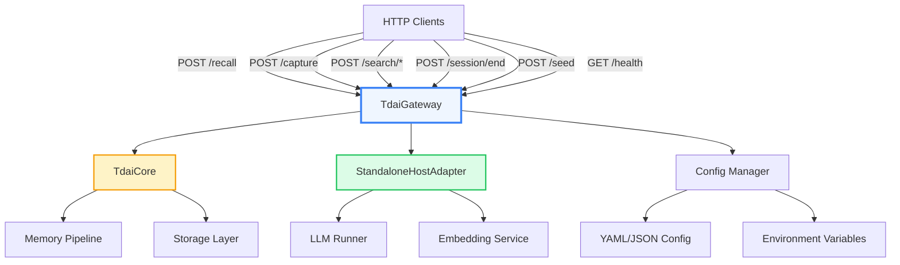

[根目录](../../CLAUDE.md) > [src](../) > **gateway**

---

# Gateway Module - HTTP Sidecar Server

> **Status**: Production | **Last Updated**: 2026-09-15
> **Responsibility**: HTTP API for TDAI Core capabilities, standalone/Hermes integration, per-user memory routing

---

## Change Log

| Date | Change | Author |
|------|--------|--------|
| 2026-09-15 | Multi-user routing: per-user TdaiCore map (LRU 64), user_id on all endpoints, /seed 403, `multiUser` config + e2e suite | Berton |
| 2026-05-24 | Module documentation created | AI Architect |

---

## Module Overview

The Gateway module provides a **lightweight HTTP sidecar server** that exposes TDAI Core capabilities as REST endpoints. It enables integration with Hermes Gateway and other HTTP-based frameworks without requiring direct Node.js embedding.

### Design Philosophy

- **Zero External Framework Dependencies**: Uses only Node.js native `http` module
- **Standalone Operation**: Runs as a managed sidecar process alongside Hermes
- **OpenAPI Compatibility**: Simple JSON request/response format
- **Graceful Shutdown**: Handles SIGTERM/SIGINT for clean process exit

---

## Architecture



---

## Multi-User Routing (multiUser)

Behind `multiUser.enabled` (default **false**), the gateway keeps a `Map<uid, {core, ready, lastAccess}>` of lazily-initialized `TdaiCore` instances, each with its own `StandaloneHostAdapter` and data directory `<baseDir>/users/<uid>/`. Isolation falls out of `initStores`'s per-dataDir caching — per-user sqlite, checkpoints, JSONL, persona are fully independent.

**Routing order** (implemented in `resolveUserIdRouting`, `src/utils/user-id.ts` — pure + unit-matrixed):

1. `multiUser.enabled === false` → main core
2. uid invalid (must match `^[a-z0-9_-]{1,64}$` after lowercase+ASCII-trim; **fail-closed, never strip**) → main core + WARN
3. uid ∈ `multiUser.ownerUserIds` → main core
4. uid === `"default"` → main core (legacy alias for the provider's static fallback)
5. otherwise → `users/<uid>/` core

**Operational rules**:
- `MAX_USER_CORES = 64`; LRU eviction (oldest `lastAccess`) logs a WARN and races `destroy()` against a 2s timeout. `resetStores(dataDir)` runs synchronously **before** the background destroy so an immediate same-uid re-request cannot inherit a closing store.
- All POST endpoints accept `user_id` and route through `_resolveCore` (async — awaits the shared init promise; search endpoints do not self-await store readiness).
- `/seed` always routes to the main core; with `multiUser.enabled`, a request whose user_id resolves to a non-owner user gets **403** `{"error":"seed is not allowed for per-user stores"}`.
- `/health` reflects the main core only.
- **Trust boundary**: user_id is caller-declared. The feature prevents teacher↔teacher cross-contamination, not local malicious processes; pair with `TDAI_GATEWAY_API_KEY` (Bearer) when exposing beyond loopback.
- uid normalization semantics are mirrored in the Python provider (`hermes-plugin/.../__init__.py` `_normalize_user_id`) — **keep both sides in sync** (ASCII-only trim + lowercase + full-match regex).

---

## API Endpoints

### 1. Health Check
```
GET /health
```

**Response**:
```json
{
  "status": "ok" | "degraded",
  "version": "0.1.0",
  "uptime": 12345,
  "stores": {
    "vectorStore": true,
    "embeddingService": true
  }
}
```

**Usage**: Monitor gateway health and startup status.

---

### 2. Memory Recall (Prefetch)
```
POST /recall
```

**Request**:
```json
{
  "query": "user's coding preferences",
  "session_key": "user-session-123",
  "user_id": "wendy"
}
```

**Response**:
```json
{
  "context": "User prefers Python over JavaScript...",
  "strategy": "hybrid",
  "memory_count": 5
}
```

**Usage**: Fetch relevant memories before an agent turn. The context is auto-injected into the agent's system prompt.

---

### 3. Conversation Capture
```
POST /capture
```

**Request**:
```json
{
  "user_content": "How do I fix this bug?",
  "assistant_content": "Try restarting the service...",
  "session_key": "user-session-123",
  "session_id": "optional-session-id",
  "user_id": "wendy",
  "messages": [
    { "role": "user", "content": "..." },
    { "role": "assistant", "content": "..." }
  ]
}
```

**Response**:
```json
{
  "l0_recorded": 2,
  "scheduler_notified": true
}
```

**Usage**: Record a conversation turn after the agent responds. Triggers L0→L1 extraction pipeline.

---

### 4. L1 Memory Search
```
POST /search/memories
```

**Request**:
```json
{
  "query": "Python vs JavaScript",
  "limit": 10,
  "type": "preference",
  "scene": "coding"
}
```

**Response**:
```json
{
  "results": "## Memories\\n\\n1. User prefers Python...",
  "total": 5,
  "strategy": "hybrid"
}
```

**Usage**: Manual search over extracted atomic facts (L1).

---

### 5. L0 Conversation Search
```
POST /search/conversations
```

**Request**:
```json
{
  "query": "bug fix",
  "limit": 10,
  "session_key": "user-session-123"
}
```

**Response**:
```json
{
  "results": "## Conversations\\n\\n1. [2026-05-24] User: How do I fix...",
  "total": 3
}
```

**Usage**: Search over raw conversation history (L0).

---

### 6. Session End
```
POST /session/end
```

**Request**:
```json
{
  "session_key": "user-session-123"
}
```

**Response**:
```json
{
  "flushed": true
}
```

**Usage**: Flush pending buffers for a session and trigger L1/L2 processing.

---

### 7. Batch Seed
```
POST /seed
```

**Request**:
```json
{
  "data": {
    "sessions": [
      {
        "session_key": "historical-session-1",
        "rounds": [
          {
            "user": "Hello",
            "assistant": "Hi there!",
            "timestamp": "2026-05-24T10:00:00Z"
          }
        ]
      }
    ]
  },
  "session_key": "override-session-key",
  "strict_round_role": false,
  "auto_fill_timestamps": true,
  "config_override": {
    "pipeline": {
      "everyNConversations": 10
    }
  }
}
```

**Response**:
```json
{
  "sessions_processed": 1,
  "rounds_processed": 50,
  "messages_processed": 100,
  "l0_recorded": 100,
  "duration_ms": 5420,
  "output_dir": "/path/to/seed-20260524-150814"
}
```

**Usage**: Batch-import historical conversations (same as CLI seed tool).

**Multi-user**: `/seed` always routes to the **main core**. With `multiUser.enabled`, a request whose `user_id` resolves to a non-owner user returns **403** `{"error":"seed is not allowed for per-user stores"}` (seeding is main-pool-only so imported history is never hidden inside a per-user store).

---

## Configuration

### Config File Resolution

The gateway searches for configuration in this order:

1. **Environment Variable**: `TDAI_GATEWAY_CONFIG` (explicit path)
2. **Current Working Directory**: `./tdai-gateway.yaml` or `./tdai-gateway.json`
3. **Data Directory**: `<dataDir>/tdai-gateway.yaml` or `<dataDir>/tdai-gateway.json`
4. **Pure Environment Variables**: No config file (use env vars only)

### Example Config (YAML)

```yaml
# tdai-gateway.yaml
server:
  port: 8420
  host: "127.0.0.1"

data:
  baseDir: "~/.memory-tencentdb/memory-tdai"

llm:
  baseUrl: "https://api.openai.com/v1"
  apiKey: "${OPENAI_API_KEY}"  # env var interpolation
  model: "gpt-4o"
  maxTokens: 4096
  timeoutMs: 120000

memory:
  storeBackend: "sqlite"
  pipeline:
    everyNConversations: 5
    enableWarmup: true
    l1IdleTimeoutSeconds: 60
  recall:
    strategy: "hybrid"
    maxResults: 5
  extraction:
    enabled: true
    maxMemoriesPerSession: 100
```

### Environment Variables

| Variable | Description | Default |
|----------|-------------|---------|
| `TDAI_GATEWAY_CONFIG` | Path to config file | - |
| `TDAI_GATEWAY_PORT` | Server port | 8420 |
| `TDAI_GATEWAY_HOST` | Server host | 127.0.0.1 |
| `TDAI_DATA_DIR` | Base data directory | `~/.memory-tencentdb/memory-tdai` |
| `TDAI_LLM_BASE_URL` | LLM API base URL | `https://api.openai.com/v1` |
| `TDAI_LLM_API_KEY` | LLM API key | - |
| `TDAI_LLM_MODEL` | LLM model name | `gpt-4o` |
| `TDAI_LLM_MAX_TOKENS` | LLM max tokens | 4096 |
| `TDAI_LLM_TIMEOUT_MS` | LLM timeout | 120000 |
| `TDAI_GATEWAY_API_KEY` | Optional Bearer auth for all routes except `/health` | - (auth off) |
| `TDAI_MULTI_USER` | Enable per-user routing ("true"/"1") | false |
| `TDAI_MULTI_USER_OWNERS` | Comma-separated owner uids → main pool | (empty) |
| `MEMORY_TENCENTDB_ROOT` | Root memory dir | `~/.memory-tencentdb` |

**Env Var Interpolation**: Config files support `${VAR_NAME}` syntax for environment variable substitution.

---

## Entry Points

### CLI Entry Point

**File**: `src/gateway/server.ts`

```bash
# Start gateway directly
node --import tsx src/gateway/server.ts

# Or after build
node dist/gateway/server.js
```

### Programmatic Usage

```typescript
import { TdaiGateway } from "./gateway/server.js";

const gateway = new TdaiGateway({
  server: { port: 8420, host: "127.0.0.1" },
  // ... other overrides
});

await gateway.start();

// Graceful shutdown
process.on("SIGINT", async () => {
  await gateway.stop();
  process.exit(0);
});
```

---

## Key Components

### TdaiGateway Class

**Main Class**: `src/gateway/server.ts`

```typescript
class TdaiGateway {
  constructor(configOverrides?: Partial<GatewayConfig>)

  // Lifecycle
  async start(): Promise<void>
  async stop(): Promise<void>

  // Multi-user (main core + per-user map, LRU 64)
  private async _resolveCore(user_id?: string): Promise<TdaiCore>  // routing order: off/invalid/owner/"default" → main, else users/<uid>
  private getCoreForUser(uid: string): UserCoreEntry               // lazy init, promise-dedup, stamps lastAccess
  private evictUserCoresIfNeeded(): void                           // LRU: resetStores(dataDir) BEFORE background destroy

  // Internal (called by HTTP router)
  private handleRequest(req, res): Promise<void>
  private handleHealth(res): void
  private handleRecall(req, res): Promise<void>
  private handleCapture(req, res): Promise<void>
  private handleSearchMemories(req, res): Promise<void>
  private handleSearchConversations(req, res): Promise<void>
  private handleSessionEnd(req, res): Promise<void>
  private handleSeed(req, res): Promise<void>
}
```

**Initialization Flow**:
1. Load config from file + env vars
2. Create `StandaloneHostAdapter`
3. Create `TdaiCore` with adapter + config
4. Initialize data directories
5. Start HTTP server on configured port

---

### Config Management

**File**: `src/gateway/config.ts`

**Key Function**:
```typescript
function loadGatewayConfig(overrides?: Partial<GatewayConfig>): GatewayConfig
```

**Features**:
- Supports YAML and JSON config files
- Environment variable interpolation (`${VAR_NAME}`)
- Backward compatibility for legacy data directories
- Sensible defaults for all fields

---

### Type Definitions

**File**: `src/gateway/types.ts`

**Core Types**:
```typescript
// Request/Response types for all endpoints
interface HealthResponse { ... }
interface RecallRequest { ... }
interface RecallResponse { ... }
interface CaptureRequest { ... }
interface CaptureResponse { ... }
// ... etc

// Error response format
interface GatewayErrorResponse {
  error: string;
}
```

**Validation**: Request bodies are validated at runtime (missing fields return 400).

---

## Deployment

### Standalone Mode

```bash
# Set environment variables
export TDAI_LLM_API_KEY="sk-..."
export TDAI_DATA_DIR="/data/memory-tdai"

# Start gateway
node dist/gateway/server.js
```

### Docker Mode (Hermes)

**File**: `docker/opensource/Dockerfile.hermes`

```bash
cd docker/opensource
docker build -f Dockerfile.hermes -t hermes-memory .
docker run -d \
  --name hermes-memory \
  -p 8420:8420 \
  -e TDAI_LLM_API_KEY="sk-..." \
  -e TDAI_LLM_BASE_URL="https://api.lkeap.cloud.tencent.com/v1" \
  -v hermes_data:/opt/data \
  hermes-memory
```

### Hermes Integration

**Python Plugin**: `hermes-plugin/memory/memory_tencentdb/`

The gateway is automatically started by the Hermes plugin as a managed sidecar process.

---

## Testing

### Manual Testing with cURL

```bash
# Health check
curl http://localhost:8420/health

# Recall
curl -X POST http://localhost:8420/recall \
  -H "Content-Type: application/json" \
  -d '{"query": "coding preferences", "session_key": "test-session"}'

# Capture
curl -X POST http://localhost:8420/capture \
  -H "Content-Type: application/json" \
  -d '{
    "user_content": "How do I use Python?",
    "assistant_content": "Python is a great language...",
    "session_key": "test-session"
  }'

# Search memories
curl -X POST http://localhost:8420/search/memories \
  -H "Content-Type: application/json" \
  -d '{"query": "Python", "limit": 5}'

# Session end
curl -X POST http://localhost:8420/session/end \
  -H "Content-Type: application/json" \
  -d '{"session_key": "test-session"}'
```

### Automated Tests

**Unit Tests**: `src/gateway/__tests__/multi-user.test.ts` (routing matrix, per-user isolation, LRU eviction, concurrent init dedup) + `src/utils/user-id.test.ts` (normalization + routing matrix)

**E2E Suite**: `src/gateway/__tests__/gateway.multi-user.e2e.test.ts` — spawns the real gateway as a subprocess (hard-refuses port 8420 and non-tmpdir data dirs; scrubs inherited `TDAI_*`/`MEMORY_TENCENTDB_*` env) and drives it over HTTP: per-user capture/search isolation, L1 extraction isolation via a mock LLM server, `/seed` 403, switch-off behavior, api-key smoke.

```bash
pnpm test:e2e
```

---

## Performance Considerations

### HTTP Server Performance

- **Framework**: Native `http` module (no Express/Fastify overhead)
- **Concurrency**: Node.js handles multiple connections asynchronously
- **Latency**: ~5-20ms per request (excluding LLM calls)

### LLM Request Bottlenecks

**Slow Operations**:
- `/recall`: ~200-700ms (vector search + embedding)
- `/seed`: ~minutes (batch processing historical data)

**Optimization**:
- Use keep-alive connections for multiple requests
- Configure appropriate `recall.timeoutMs` to avoid blocking
- Monitor queue sizes in logs for pipeline health

---

## Debugging

### Log Output

The gateway uses structured logging with tags:
```
[tdai-gateway] Gateway listening on http://127.0.0.1:8420
[tdai-gateway] Recall completed in 234ms: context=1234 chars
[tdai-gateway] Capture completed in 45ms: l0=2
```

### Common Issues

1. **Port Already in Use**
   - **Symptom**: `EADDRINUSE` error on startup
   - **Fix**: Change `TDAI_GATEWAY_PORT` or kill the process using port 8420

2. **LLM Connection Refused**
   - **Symptom**: `/recall` or `/seed` times out
   - **Fix**: Verify `TDAI_LLM_BASE_URL` and `TDAI_LLM_API_KEY` are correct

3. **Data Directory Not Writable**
   - **Symptom**: `EACCES` error when writing files
   - **Fix**: Check permissions on `TDAI_DATA_DIR` (or parent directory)

4. **Config File Not Found**
   - **Symptom**: Uses defaults instead of custom config
   - **Fix**: Verify `TDAI_GATEWAY_CONFIG` path or place config in CWD

### Diagnostic Endpoints

```bash
# Check health (includes store status)
curl http://localhost:8420/health | jq

# Monitor logs (if running in foreground)
# Logs are written to stdout/stderr
```

---

## Extension Points

### Custom Endpoints

To add custom endpoints, modify `handleRequest()` in `server.ts`:

```typescript
// Add new route
case "POST /custom":
  return await this.handleCustom(req, res);

// Implement handler
private async handleCustom(req, res): Promise<void> {
  const body = await parseJsonBody<CustomRequest>(req);
  // ... custom logic
  sendJson(res, 200, { result: "ok" });
}
```

### Custom Authentication

Add middleware in `handleRequest()` before routing:

```typescript
// Verify API key
const authHeader = req.headers["authorization"];
if (!verifyAuth(authHeader)) {
  sendJson(res, 401, { error: "Unauthorized" });
  return;
}
```

---

## Related Files

**Core Logic**:
- `src/core/tdai-core.ts` - Core memory engine
- `src/adapters/standalone/host-adapter.ts` - Host abstraction for standalone mode
- `src/adapters/standalone/llm-runner.ts` - LLM integration

**Configuration**:
- `src/config.ts` - Memory-tdai config parsing
- `src/gateway/config.ts` - Gateway-specific config

**Hermes Plugin**:
- `hermes-plugin/memory/memory_tencentdb/` - Python integration

---

**Next**: [Core Engine](../core/CLAUDE.md) | [Adapters](../adapters/CLAUDE.md) | [Back to Root](../../CLAUDE.md)
