[根目录](../../CLAUDE.md) > [src](../) > **utils**

---

# Utils Module - Shared Utilities & Infrastructure

> **Status**: Stable | **Last Updated**: 2026-09-15
> **Responsibility**: Checkpoint management, pipeline orchestration, backup utilities, shared helpers

---

## Change Log

| Date | Change | Author |
|------|--------|--------|
| 2026-09-15 | Added `user-id.ts`: uid normalization + per-user routing matrix (gateway multi-user) | Berton |
| 2026-05-24 | Module documentation created | AI Architect |

---

## Module Overview

The Utils module provides **foundational infrastructure** for the memory system, including state persistence, pipeline orchestration, backup management, and various utility functions used across the core, offload, and adapter layers.

### Design Philosophy

- **Zero Dependencies**: Most utilities use only Node.js built-ins (no external deps)
- **Concurrency Safety**: File locking, serial queues, and atomic writes prevent race conditions
- **Graceful Degradation**: Operations fail safely without blocking the entire system
- **Testability**: Pure functions and clear interfaces make unit testing straightforward

---

## Architecture

```mermaid
graph TD
    A["Utils Module"] --> B["Checkpoint Manager"]
    A --> C["Pipeline Manager"]
    A --> D["Backup Manager"]
    A --> E["Serial Queue"]
    A --> F["Managed Timer"]
    A --> G["Other Utilities"]

    B --> B1["State Persistence"]
    B --> B2["Session Tracking"]
    B --> B3["Atomic Capture"]

    C --> C1["L0→L1→L2→L3 Orchestration"]
    C --> C2["Timer Management"]
    C --> C3["Warm-up Mode"]

    D --> D1["File Backup"]
    D --> D2["Directory Backup"]
    D --> D3["Automatic Pruning"]

    E --> E1["Concurrency=1 Tasks"]
    E --> E2["Graceful Shutdown"]

    F --> F1["Resettable Timer"]
    F --> F2["Downward-only Timer"]

    G --> G1["Text Processing"]
    G --> G2["Environment Variables"]
    G --> G3["Session Filtering"]

    style B fill:#eff6ff,stroke:#3b82f6,stroke-width:2px
    style C fill:#fef3c7,stroke:#f59e0b,stroke-width:2px
    style D fill:#dcfce7,stroke:#22c55e,stroke-width:2px
    style E fill:#f3e8ff,stroke:#a855f7,stroke-width:2px
```



---

## Key Components

### 1. CheckpointManager (`checkpoint.ts`)

**Purpose**: Track memory processing progress across process restarts.

**Key Features**:
- **Split-State Design**: Prevents race conditions between pipeline and runner state updates
- **Per-File Locking**: Serializes concurrent access via `withFileLock()`
- **Atomic Writes**: Uses `tmp + rename` to prevent corruption on crashes
- **Backward Compatibility**: Migrates old checkpoint formats automatically

**Core Operations**:
```typescript
class CheckpointManager {
  // Read-only snapshot (no lock)
  async read(): Promise<Checkpoint>

  // Mutating operations (all serialized via file lock)
  async markL1ExtractionComplete(sessionKey, memoriesExtracted, cursor, lastSceneName)
  async captureAtomically(sessionKey, pluginStartTimestamp, captureCallback)
  async mergePipelineStates(states: Record<string, PipelineSessionState>)

  // Persona (L3) management
  async markPersonaGenerated(totalProcessed)
  async setPersonaUpdateRequest(reason)
}
```

**Split-State Architecture**:
- **`runner_states`**: Owned by CheckpointManager (L0 cursor, L1 cursor, scene name)
- **`pipeline_states`**: Owned exclusively by PipelineManager (conversation counts, extraction times)

This separation eliminates the "split-brain overwrite bug" where pipeline updates could clobber runner-written fields.

---

### 2. MemoryPipelineManager (`pipeline-manager.ts`)

**Purpose**: Orchestrate L0→L1→L2→L3 memory extraction with timers and queues.

**Key Features**:
- **Warm-up Mode**: New sessions start with aggressive L1 triggering (1→2→4→8→...→N)
- **Dual Timer Types**: L1 uses resettable idle timer, L2 uses downward-only schedule timer
- **Serial Queues**: L1/L2/L3 tasks run with concurrency=1 via SerialQueue
- **Session GC**: Evicts cold sessions from memory after inactivity period

**Trigger Paths for L1**:
```
Path A (Threshold): conversation_count >= effectiveThreshold → trigger immediately
Path B (Idle): session goes idle for l1IdleTimeoutSeconds → trigger with buffered messages
Path C (Shutdown): flushSession() or destroy() → flush pending buffers
```

**Trigger Paths for L2**:
```
Path A (Delay-after-L1): L1 completes → arm L2 timer with delay
Path B (MaxInterval): L2 completes → arm L2 timer for next periodic run
Path C (Shutdown): destroy() → flush pending L2 timers
```

**Core API**:
```typescript
class MemoryPipelineManager {
  // Setup
  setL1Runner(runner: L1Runner)
  setL2Runner(runner: L2Runner)
  setL3Runner(runner: L3Runner)
  setPersister(persister: PipelineStatePersister)

  // Lifecycle
  start(restoredStates?: Record<string, PipelineSessionState>)
  async destroy()
  async flushSession(sessionKey: string)

  // L0→L1
  async notifyConversation(sessionKey: string, messages: CapturedMessage[])
}
```

---

### 3. BackupManager (`backup.ts`)

**Purpose**: Generic file/directory backup with automatic pruning.

**Key Features**:
- **Timestamped Backups**: Names embed timestamps (e.g., `persona_20260524_150814_offset42.md`)
- **Automatic Pruning**: Keeps only the newest `maxKeep` entries per category
- **Best-Effort**: Silently skips missing source files

**API**:
```typescript
class BackupManager {
  async backupFile(srcFile, category, tag, maxKeep)
  async backupDirectory(srcDir, category, tag, maxKeep)
}
```

**Usage Examples**:
```typescript
// Backup persona before regeneration
await backupManager.backupFile(
  path.join(dataDir, "L3/persona.md"),
  "persona",
  `offset${totalProcessed}`,
  10  // keep 10 latest
);

// Backup all L2 scene blocks
await backupManager.backupDirectory(
  path.join(dataDir, "L2"),
  "scene_blocks",
  `offset${totalProcessed}`,
  5
);
```

---

### 4. SerialQueue (`serial-queue.ts`)

**Purpose**: Lightweight task queue with concurrency=1 (zero dependencies).

**Key Features**:
- **FIFO Execution**: Tasks run in the order they're added
- **Graceful Shutdown**: `onIdle()` waits for all queued tasks to complete
- **Pause/Resume**: Temporarily suspend execution without clearing the queue
- **Debug Logging**: Optional logger for enqueue/dequeue diagnostics

**API**:
```typescript
class SerialQueue {
  add<T>(task: () => Promise<T>): Promise<T>
  onIdle(): Promise<void>
  pause()
  start()
  clear()
  get size(): number
  get pending(): boolean
  get idle(): boolean
}
```

**Design Decision**: Implemented instead of using `p-queue` to avoid external dependencies. Performance is equivalent for concurrency=1 use cases.

---

### 5. ManagedTimer (`managed-timer.ts`)

**Purpose**: Unified timer management with two semantics.

**Timer Types**:

1. **Resettable Timer** (classic idle/debounce):
   - Each `schedule()` call resets the countdown
   - Used for L1 idle timeout
   - Example: `schedule(60000, callback)` → fires 60s after last call

2. **Downward-Only Timer** (monotonic schedule):
   - Fire time can only move earlier, never later
   - Used for L2 scheduling
   - `tryAdvanceTo(desiredTime, callback)` → updates only if earlier

**API**:
```typescript
class ManagedTimer {
  schedule(delayMs, callback)           // resettable: resets countdown
  scheduleAt(fireTime, callback)        // downward-only: sets absolute time
  tryAdvanceTo(desiredTime, callback)   // downward-only: only if earlier
  cancel()
  flush()                               // fire immediately
  get pending(): boolean
}
```

**Usage Pattern**:
```typescript
// L1: resettable idle timer
l1Idle.schedule(60000, () => this.onL1IdleTimeout(sessionKey));

// L2: downward-only schedule timer
const desiredTime = Math.max(now + delay, lastL2 + minInterval);
l2Schedule.tryAdvanceTo(desiredTime, () => this.onL2TimerFired(sessionKey));
```

---

## Other Utilities

### Text Processing (`text-utils.ts`)
- `truncateText(text, maxLength)`: Truncate with ellipsis
- `sanitizeText(text)`: Remove control characters, preserve non-BMP Unicode
- `estimateTokens(text)`: Rough token estimation (≈ chars / 4)

### Environment Variables (`env.ts`)
- `getEnv(key)`: Read from `process.env`
- `getEnvNumber(key)`: Parse as number
- `getEnvBoolean(key)`: Parse as boolean

### Session Filter (`session-filter.ts`)
```typescript
class SessionFilter {
  constructor(excludeAgents: string[] = [])
  shouldSkip(sessionKey: string): boolean  // true = skip processing
}
```

Filters out internal sessions (e.g., `_internal_*`) and agent-specific patterns.

### Manifest (`manifest.ts`)
- `writeManifest(dataDir, buildInfo)`: Writes `.build.json` with build metadata
- Used for version tracking and debugging.

### Memory Cleaner (`memory-cleaner.ts`)
- `cleanOldMemory(dataDir, olderThanMs)`: Removes old L0/L1/L2/L3 files
- Used for manual maintenance scripts.

### Managed Timer (`managed-timer.ts`)
- See section 5 above.

### Serial Queue (`serial-queue.ts`)
- See section 4 above.

### Backup (`backup.ts`)
- See section 3 above.

### Checkpoint (`checkpoint.ts`)
- See section 1 above.

### Pipeline Manager (`pipeline-manager.ts`)
- See section 2 above.

### Pipeline Factory (`pipeline-factory.ts`)
- `createPipelineManager(config, logger, sessionFilter)`: Constructs fully-configured pipeline
- `initDataDirectories(dataDir)`: Creates L0/L1/L2/L3/.metadata directories

### Clean Context Runner (`clean-context-runner.ts`)
- Wraps LLM calls with context sanitization and error handling.

### Ensure Hook Policy (`ensure-hook-policy.ts`)
- Validates that required OpenClaw hooks are registered.

### Sanitize (`sanitize.ts`)
- `sanitizeForLLM(text)`: Removes characters that can break LLM parsing
- Preserves Chinese, emojis, and non-BMP Unicode (fix for https://github.com/Tencent/TencentDB-Agent-Memory/pull/31).

---

## 6. User ID Routing (`user-id.ts`)

**Purpose**: Normalization + pool routing for gateway multi-user mode. Pure functions, fully matrix-tested (`user-id.test.ts`).

```typescript
normalizeUserId(raw: unknown): string | null
// lowercase(ascii-trim(raw)); full-match ^[a-z0-9_-]{1,64}$ else null.
// Fail-closed: never strips characters (wendy.li stays invalid — no silent collision with wendyli).

resolveUserIdRouting(
  opts: { multiUserEnabled: boolean; ownerUserIds: string[] },
  raw: unknown
): { uid: string | null; pool: "main" | "user"; warn: boolean }
// Order: off → main; invalid → main+warn; owner → main; "default" → main (legacy alias);
// else users/<uid> pool. Owner entries are normalized before comparison.
```

**Sync obligation**: the Python provider mirrors this semantics in `hermes-plugin/memory/memory_tencentdb/__init__.py` (`_normalize_user_id`) — **any change here must be applied to both sides** (pairing tests exist in `user-id.test.ts` and `tests/test_multi_user_identity.py`).

---

## Entry Points

### Main Exports
**File**: `src/utils/index.ts` (if present) or individual imports

```typescript
// Checkpoint management
export { CheckpointManager } from "./checkpoint.js";

// Pipeline orchestration
export { MemoryPipelineManager } from "./pipeline-manager.js";

// Utilities
export { BackupManager } from "./backup.js";
export { SerialQueue } from "./serial-queue.js";
export { ManagedTimer } from "./managed-timer.js";
export { SessionFilter } from "./session-filter.js";
```

---

## Configuration

### Pipeline Configuration
```typescript
interface PipelineConfig {
  everyNConversations: number;       // L1 trigger threshold
  enableWarmup: boolean;             // Warm-up mode for new sessions
  l1: {
    idleTimeoutSeconds: number;      // L1 idle timeout
  };
  l2: {
    delayAfterL1Seconds: number;     // Delay after L1 before L2
    minIntervalSeconds: number;      // Minimum L2 interval
    maxIntervalSeconds: number;      // Maximum L2 interval
    sessionActiveWindowHours: number;// Session activity window
  };
}
```

**Defaults** (from `PLUGIN_DEFAULTS` in `src/config.ts`):
```typescript
pipeline: {
  everyNConversations: 5,
  enableWarmup: true,
  l1IdleTimeoutSeconds: 60,
  l2DelayAfterL1Seconds: 90,
  l2MinIntervalSeconds: 900,   // 15 minutes
  l2MaxIntervalSeconds: 3600,  // 1 hour
  l2SessionActiveWindowHours: 24,
}
```

---

## Data Models

### Checkpoint State
```typescript
interface Checkpoint {
  // Global counters
  last_captured_timestamp: number;
  total_processed: number;
  last_persona_at: number;
  last_persona_time: string;
  request_persona_update: boolean;
  persona_update_reason: string;
  memories_since_last_persona: number;
  scenes_processed: number;

  // Per-session split state
  runner_states: Record<string, RunnerSessionState>;
  pipeline_states: Record<string, PipelineSessionState>;

  // Layer counts
  l0_conversations_count: number;
  total_memories_extracted: number;
}
```

### Runner Session State (L0/L1 owned)
```typescript
interface RunnerSessionState {
  last_captured_timestamp: number;   // L0 capture cursor
  last_l1_cursor: number;            // L1 extraction cursor
  last_scene_name: string;           // Last L1 scene name
}
```

### Pipeline Session State (PipelineManager owned)
```typescript
interface PipelineSessionState {
  conversation_count: number;            // Conversations since last L1
  last_extraction_time: string;          // Last L1 completion time
  last_extraction_updated_time: string;  // L1 cursor for incremental reads
  last_active_time: number;              // Last activity timestamp
  l2_pending_l1_count: number;           // L1 batches pending L2
  warmup_threshold: number;              // Current warm-up threshold (0=graduated)
  l2_last_extraction_time: string;       // Last L2 completion time
}
```

---

## Testing

### Test Structure
- **Unit Tests**: `src/utils/*.test.ts` (co-located with source)
- **Integration Tests**: Used by core/offload tests indirectly

### Key Test Scenarios
1. **Checkpoint Concurrency**: Multiple processes writing simultaneously
2. **Pipeline Recovery**: State restoration after crash
3. **Timer Semantics**: Resettable vs. downward-only behavior
4. **Queue Ordering**: FIFO execution under load
5. **Backup Pruning**: Old entries removed correctly

---

## Common Patterns

### 1. Atomic File Operations
```typescript
// Use tmp + rename for crash safety
const tmp = `${filePath}.tmp.${randomBytes(4).toString("hex")}`;
await fs.writeFile(tmp, data);
await fs.rename(tmp, filePath);  // atomic on POSIX
```

### 2. Per-File Locking
```typescript
// Serialize access via shared lock map
const fileLocks = new Map<string, Promise<void>>();

async function withFileLock<T>(filePath: string, fn: () => Promise<T>) {
  const prev = fileLocks.get(filePath) ?? Promise.resolve();
  // ... chain and execute
}
```

### 3. Graceful Shutdown
```typescript
// Wait for queues to drain with timeout
await Promise.race([
  this.flushAllQueues(),
  new Promise((_, reject) => setTimeout(() => reject(new Error("timeout")), 2000)),
]);
```

---

## Performance Considerations

### Checkpoint I/O
- **Read Frequency**: Once on startup, then unlocked snapshots for status checks
- **Write Frequency**: Every L1 completion, L2 completion, persona generation
- **Latency**: ~1-5ms per write (local SSD)
- **Optimization**: Batch multiple updates into a single `mutate()` call

### Pipeline Overhead
- **Timer Management**: O(1) per session (heap-based scheduling)
- **Queue Latency**: <1ms for idle queue, network-bound for LLM tasks
- **Memory Usage**: ~1-2KB per active session (state + timers)

### Backup Performance
- **File Copy**: Uses `fs.copyFile` (kernel-level, very fast)
- **Pruning**: O(n log n) for sorting, O(n) for deletion
- **Space Usage**: Linear with backup retention count

---

## Debugging

### Log Locations
- **Checkpoint File**: `~/.openclaw/memory-tdai/.metadata/recall_checkpoint.json`
- **Backup Directory**: `~/.openclaw/memory-tdai/.backup/`

### Diagnostic Commands
```bash
# View checkpoint
cat ~/.openclaw/memory-tdai/.metadata/recall_checkpoint.json | jq

# Count backups
ls -1 ~/.openclaw/memory-tdai/.backup/persona/ | wc -l

# Monitor queue sizes (if debug logging enabled)
grep "queue.*pending" ~/.openclaw/logs/memory-tdai.log
```

### Common Issues

1. **Checkpoint Corruption**
   - **Symptom**: `JSON.parse` fails on read
   - **Cause**: Process crash during write (rare due to atomic writes)
   - **Fix**: Delete checkpoint file (will recreate with defaults)

2. **Timer Not Firing**
   - **Symptom**: L1/L2 not triggering
   - **Cause**: Timer destroyed or session filtered
   - **Fix**: Check session filter settings, verify `!destroyed` flag

3. **Backup Directory Full**
   - **Symptom**: Disk space warning
   - **Cause**: `maxKeep` set too high or backups too frequent
   - **Fix**: Reduce `maxKeep` or manually prune old backups

---

## Extension Points

### Custom Timer Implementation
Replace `ManagedTimer` with custom scheduling logic:
```typescript
interface ITimer {
  schedule(delayMs, callback): void;
  cancel(): void;
  get pending(): boolean;
}
```

### Custom State Persister
Replace default checkpoint persister:
```typescript
type PipelineStatePersister = (states: Record<string, PipelineSessionState>) => Promise<void>;
```

Example: Redis-based persister for distributed systems.

---

## Related Files

**Core Logic**:
- `src/core/hooks/auto-capture.ts` - Uses checkpoint for L0/L1 tracking
- `src/offload/state-manager.ts` - Uses serial queue for offload tasks
- `src/adapters/openclaw/host-adapter.ts` - Uses pipeline factory for initialization

**Configuration**:
- `src/config.ts` - Default pipeline configuration

---

**Next**: [Core Engine](../core/CLAUDE.md) | [Context Offload](../offload/CLAUDE.md) | [Back to Root](../../CLAUDE.md)
